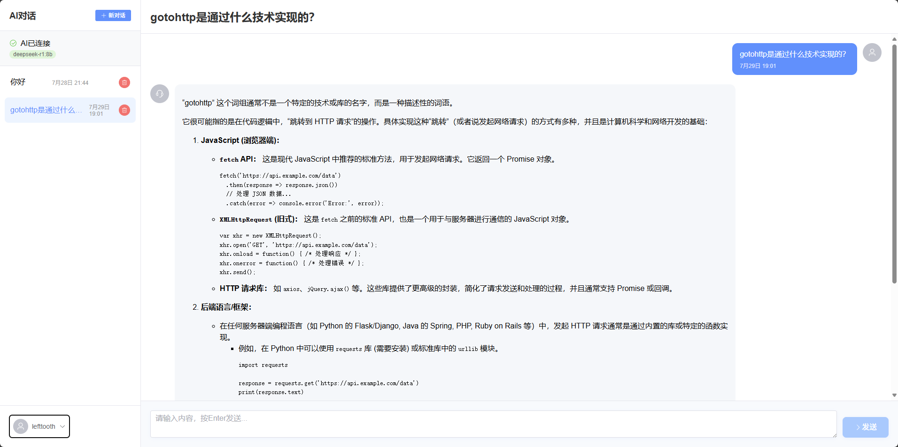

# AI对话界面

一个基于Vue3+TypeScript前端和FastAPI后端的AI对话界面项目，集成了本地Ollama AI模型。

## 项目结构

```
AI/
├── frontend/          # Vue3 + TypeScript 前端
├── backend/           # FastAPI 后端
├── database/          # 数据库相关文件
└── README.md
```


## 技术栈

### 前端
- Vue 3
- TypeScript
- Vite
- Element Plus (UI组件库)
- Axios (HTTP客户端)

### 后端
- FastAPI
- Python 3.8+
- SQLAlchemy (ORM)
- MySQL
- Pydantic (数据验证)
- Ollama API集成

### AI模型
- Ollama (本地AI模型服务)
- DeepSeek-R1:8B (默认模型)

## 环境要求

### 基础环境
- Python 3.8+
- Node.js 16+
- MySQL 5.7+ 或 8.0+

### Ollama环境
- Ollama (https://ollama.ai/)
- DeepSeek-R1:8B模型

## 快速开始

### 1. 安装Ollama

#### Windows
```bash
# 下载并安装Ollama
# 访问 https://ollama.ai/download
```

#### Linux/Mac
```bash
curl -fsSL https://ollama.ai/install.sh | sh
```

### 2. 下载AI模型
```bash
# 下载DeepSeek-R1:8B模型
ollama pull deepseek-r1:8b

# 验证模型
ollama list
```

### 3. 启动Ollama服务
```bash
# 启动Ollama服务
ollama serve
```

### 4. 配置数据库
确保MySQL服务已启动，并创建数据库：
```sql
CREATE DATABASE ai_chat_db CHARACTER SET utf8mb4 COLLATE utf8mb4_unicode_ci;
```

### 5. 启动后端
```bash
cd backend
pip install -r requirements.txt
python test_ollama.py  # 测试Ollama连接
uvicorn main:app --reload
```

### 6. 启动前端
```bash
cd frontend
npm install
npm run dev
```

## 快速启动脚本

### Windows用户
1. 双击运行 `start_backend.bat` 启动后端
2. 双击运行 `start_frontend.bat` 启动前端

### Linux/Mac用户
```bash
chmod +x start_backend.sh start_frontend.sh
./start_backend.sh
./start_frontend.sh
```

## 功能特性

### 用户管理
- 用户注册/登录
- JWT token认证
- 用户信息管理

### AI对话功能
- 集成本地Ollama AI模型
- 实时AI对话
- 对话历史记录
- 上下文记忆

### 界面特性
- 响应式设计
- 现代化UI
- AI连接状态显示
- 实时消息显示
- 用户友好的交互

## API接口

### 认证接口
- `POST /register` - 用户注册
- `POST /token` - 用户登录
- `GET /users/me` - 获取当前用户信息

### 对话接口
- `GET /conversations` - 获取对话列表
- `POST /conversations` - 创建新对话
- `GET /conversations/{id}` - 获取对话详情

### 聊天接口
- `POST /chat` - 发送消息并获取AI回复

### AI状态接口
- `GET /ai/status` - 获取AI服务状态

## 配置说明

### 环境变量配置
创建 `backend/.env` 文件：
```env
DATABASE_URL=mysql+pymysql://用户名:密码@localhost:3306/ai_chat_db
SECRET_KEY=your-secret-key-here
ALGORITHM=HS256
ACCESS_TOKEN_EXPIRE_MINUTES=30
OLLAMA_BASE_URL=http://localhost:11434
OLLAMA_MODEL=deepseek-r1:8b
```

### 支持的AI模型
- deepseek-r1:8b (默认)
- llama2:7b
- llama2:13b
- codellama:7b
- 其他Ollama支持的模型

## 故障排除

### Ollama连接问题
1. 确保Ollama服务正在运行：`ollama serve`
2. 检查模型是否已下载：`ollama list`
3. 测试API连接：`curl http://localhost:11434/api/tags`

### 数据库连接问题
1. 确保MySQL服务正在运行
2. 检查数据库连接字符串
3. 确认数据库和表已创建

### 前端连接问题
1. 确保后端服务正在运行（端口8000）
2. 检查CORS配置
3. 确认代理配置正确

## 开发说明

### 后端开发
- 使用FastAPI框架
- SQLAlchemy作为ORM
- Pydantic进行数据验证
- JWT进行身份认证
- 集成Ollama API

### 前端开发
- Vue3 Composition API
- TypeScript类型支持
- Element Plus UI组件
- Pinia状态管理

## 部署说明

### 生产环境部署
1. 配置生产环境变量
2. 使用生产级数据库
3. 配置反向代理（如Nginx）
4. 启用HTTPS
5. 配置日志和监控

### Docker部署（可选）
项目支持Docker容器化部署，可以创建Dockerfile和docker-compose.yml文件。

## 许可证

MIT License 
